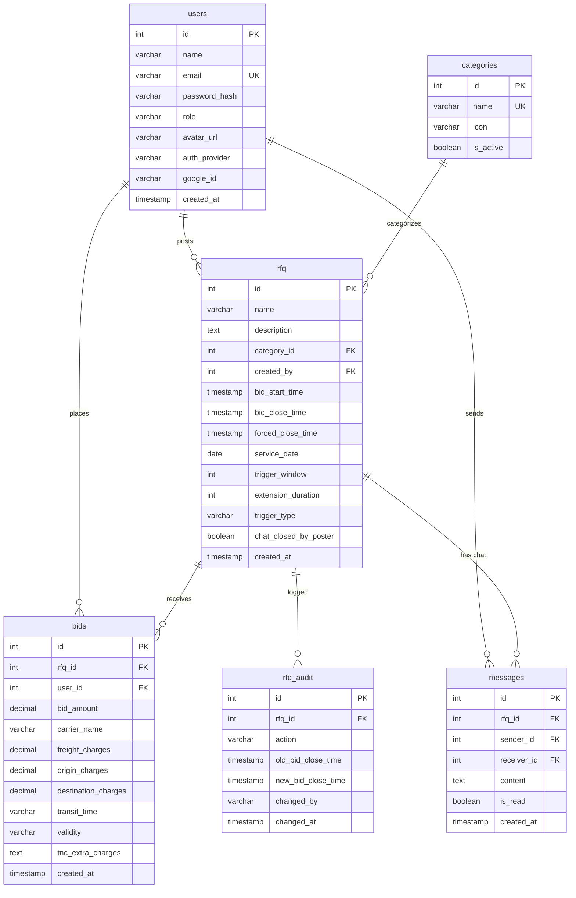

# LazyList — System Architecture

## High-Level Overview

LazyList is a real-time reverse auction platform where service requesters post RFQs (Request for Quotations) and service providers compete by placing bids. The lowest bidder (L1) wins. Post-auction, the poster and winner can negotiate via a time-limited chat.

---

## Technology Stack

| Layer | Technology | Purpose |
|:--|:--|:--|
| Frontend | React 18 + Vite | Single-page application |
| Styling | Vanilla CSS (custom design system) | Professional dark theme |
| Backend | Node.js + Express | REST API server |
| Real-Time | Socket.io | WebSocket-based bid/chat updates |
| Database | Neon PostgreSQL (Serverless) | Cloud-hosted relational database |
| Auth | JWT + Google OAuth 2.0 | Dual authentication |
| Deployment | AWS EC2 + Docker | Container-based hosting |
| CI/CD | GitHub Actions | Auto-deploy on push to main |

---

## System Flow Diagram

```mermaid
sequenceDiagram
    autonumber
    participant U as User (Browser)
    participant F as Frontend (React/Vite)
    participant B as Backend (Express + Socket.io)
    participant DB as Neon PostgreSQL

    Note over U,DB: Authentication Flow
    U->>F: Login (Email/Password or Google)
    F->>B: POST /api/auth/login or /api/auth/google
    B->>DB: Verify credentials / upsert Google user
    DB-->>B: User row
    B-->>F: JWT token + user data
    F-->>U: Store token, redirect to home

    Note over U,DB: Browse & Post RFQ
    U->>F: Open home page
    F->>B: GET /api/rfqs
    B->>DB: SELECT rfq JOIN categories, users, bids (single query with NOW())
    DB-->>B: RFQ list with computed status
    B-->>F: JSON response
    F-->>U: Render auction cards

    Note over U,DB: Real-Time Bidding
    U->>F: Open auction detail page
    F->>B: WebSocket connect + join room rfq-{id}
    U->>F: Submit bid form
    F->>B: POST /api/bids
    B->>DB: INSERT bid, check extension trigger
    B->>B: Emit 'bid-updated' to room rfq-{id}
    B-->>F: All clients receive updated rankings instantly
    F-->>U: Live leaderboard update (no refresh)

    Note over U,DB: Post-Auction Chat
    U->>F: Auction closes (status auto-transitions)
    F->>B: GET /api/messages/{rfqId} (single validation query)
    B->>DB: Fetch messages + validate access
    DB-->>B: Message history + chat_closed flag
    B-->>F: Messages + partner info
    U->>F: Send message
    F-->>U: Optimistic render (0ms)
    F->>B: POST /api/messages/{rfqId}
    B->>DB: INSERT message
    B->>B: Emit 'message-received' to room rfq-{id}-chat
```



---

## Database Schema (v3)



---

## WebSocket Room Architecture

```
Socket.io Server
├── Room: rfq-{id}           (Bid updates for auction detail page)
│   ├── Event: 'bid-updated'  → { rfq, rankings, bid, extension }
│   └── Listeners: All users viewing that auction
│
└── Room: rfq-{id}-chat      (Post-auction chat messages)
    ├── Event: 'message-received' → { id, content, sender_name, ... }
    ├── Event: 'chat-closed'      → (empty, triggers UI lock)
    └── Listeners: Poster + L1 winner only
```

---

## Deployment Architecture

```
┌─────────────────────────────────────────────────────┐
│                    GitHub Actions                     │
│  (Triggers on push to main branch)                   │
│                                                       │
│  ┌──────────────┐     ┌────────────────────────┐     │
│  │ Backend Push  │     │  Frontend Push          │     │
│  │ SSH → EC2     │     │  npm run build → SCP    │     │
│  │ docker build  │     │  dist/ → EC2/Nginx      │     │
│  └──────┬───────┘     └────────────┬───────────┘     │
└─────────┼──────────────────────────┼─────────────────┘
          │                          │
          ▼                          ▼
┌─────────────────────────────────────────────────────┐
│              AWS EC2 (t3.small)                      │
│                                                       │
│  ┌─────────────────────┐  ┌────────────────────┐    │
│  │  Docker Container    │  │  Nginx              │    │
│  │  Node.js + Express   │  │  Serves dist/       │    │
│  │  Socket.io Server    │  │  Reverse proxy :5000│    │
│  │  Port 5000           │  │  Port 80/443        │    │
│  └──────────┬──────────┘  └────────────────────┘    │
└─────────────┼────────────────────────────────────────┘
              │
              ▼
┌─────────────────────────────────────────────────────┐
│         Neon PostgreSQL (Serverless)                  │
│         us-east-1 (same region as EC2)               │
│         Keep-alive ping every 4 minutes              │
└─────────────────────────────────────────────────────┘
```

---

## API Endpoints Summary

| Method | Endpoint | Auth | Description |
|:--|:--|:--|:--|
| POST | `/api/auth/register` | No | Register with email/password |
| POST | `/api/auth/login` | No | Login with email/password |
| POST | `/api/auth/google` | No | Login/register with Google |
| GET | `/api/rfqs` | Yes | List all RFQs |
| POST | `/api/rfqs` | Yes (User) | Create new RFQ |
| GET | `/api/rfqs/:id` | Yes | Get RFQ detail + rankings |
| DELETE | `/api/rfqs/:id` | Yes (Admin) | Delete an RFQ |
| POST | `/api/bids` | Yes (User) | Place a bid |
| GET | `/api/categories` | Yes | List categories |
| GET | `/api/messages/:rfqId` | Yes | Get chat messages |
| POST | `/api/messages/:rfqId` | Yes | Send a chat message |
| POST | `/api/messages/:rfqId/close` | Yes | Manually close chat |
| GET | `/api/admin/users` | Yes (Admin) | List all users |
| DELETE | `/api/admin/users/:id` | Yes (Admin) | Delete a user |
